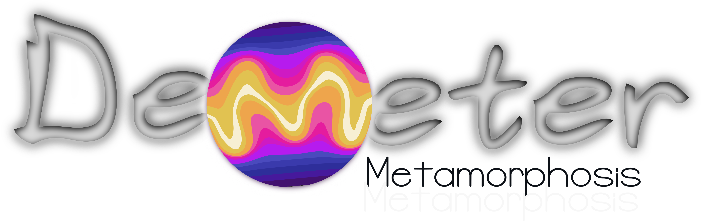
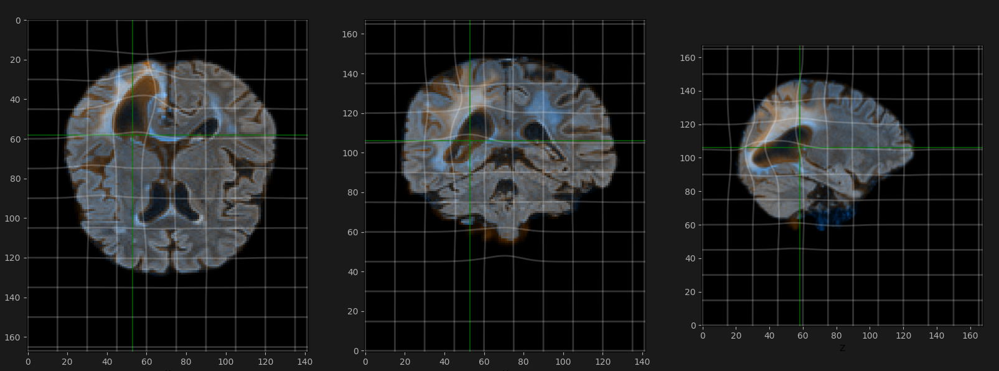

# Demeter 0.2.3

(DiffEoMorphic METamorphic Regristration)

Package status : alpha. see [Documentation](https://antonfrancois.github.io/Demeter_metamorphosis/)
[slides](https://slides.com/antonfrancois/metamorphosis-presentation-inria)



Demeter_metamorphosis is a library intended to perform Metamorphosis on images.
It can perform efficient registration of images in 2D and 3D with or without topology differences.
We propose a flexible framework to perform Metamorphosis with differents modeling
choices. Are provided:
- The classic LDDMM registration method for registering image having the same topologies as described by Trouvé et al. or Beg's 2005 paper.
- The classic Metamorphosis registration method for mixing diffeomorphic transport with intensities additions as described in Younes's book "Shape and Diffeomorphisms" (2019).
- A Weighted Metamorphosis registration method to control the intensity addition locally as described by me in [this paper](https://hal.science/hal-03971473)
- A Constrained Metamorphosis registration method to control the intensity addition locally and guide the registration with a pre-computed vector field as described by me in [my thesis](https://u-paris.fr/theses/detail-dune-these/?id_these=5642). (paper comming soon)
- and more to come...

The library is designed to be flexible and allow the user to define custom data cost functions, custom norms on the residual, custom vector fields, and custom geodesic integrators. Feel
free to contact me through github Issues if you have any questions or need help with the library.

Why the name Demeter ? Because in ancient Rome, Demeter was the goddess of agriculture.
Isn't it the perfect protection for or vectors fields ? 

The Metamorphic framework [Holm et al., 2009; Trouvé and Younes, 2005; Younes, 2019]
can be seen as a relaxed version of [LDDMM ](https://en.wikipedia.org/wiki/Large_deformation_diffeomorphic_metric_mapping)
in which we add time-varying intensity variations
are added to the diffeomorphic flow, therefore allowing for topological changes. The
image evolution is not only modelled by deformation, we allow adding intensity at each
time for every voxel, making topological changes possible. Metamorphosis is solved through
an Hamiltonian formulation and the momentum control both the deformation and the intensity changes.

You can find more information on the [documentation](https://antonfrancois.github.io/Demeter_metamorphosis/)
but also follow a rapid introduction in the following slides:
[slides](https://slides.com/antonfrancois/metamorphosis-presentation-inria)

## Installation
At the moment, demeter-metamorphosis is available on linux and macOS only.
Windows user can use the [WSL](https://learn.microsoft.com/en-us/windows/wsl/about) to install the package.

### WSL setup (for Windows users):

WSL is a compatibility layer for running Linux binary executables natively on Windows 10 and Windows Server 2019. It is a feature of the Windows operating system that allows you to run a Linux distribution directly on Windows without using a virtual machine or container.
So first install WSL and then you can follow the Unix installation steps.

Install wsl:
```bash
 wsl --install
```

You might need to restart your computer to finish the installation process.

Open a terminal wsl. After the installation is completed, open wsl, set up a password. 
 
```bash
sudo apt update
sudo apt install python3-pip
sudo apt install python3.12-venv
```

### For Unix systems, (Linux and macOS)

First I advise you to create a fresh virtual environment with conda or venv. With venv [more...](https://packaging.python.org/en/latest/guides/installing-using-pip-and-virtual-environments/#create-and-use-virtual-environments):

```bash
conda create -n demeter_env python=3.12
conda activate demeter_env
```
OR conda
```bash
python3.12 -m venv "demeter_env"
source "demeter_env"/bin/activate
```
The last line activate the virtual environment. Please ensure that you are in the
virtual environment when you are using the package.

You are now ready to install the package.  For a direct usage of demeter you 
can install the package with pip, if you want to have a 
#### From pip

```bash
pip install demeter-metamorphosis
```

#### From source
If you want the development version or consider contributing to the codebase,
you can also install scikit-shapes locally from a clone of the repository. 

Then clone the repository with one of the github provided methods. For
example, with html:
```bash
git clone https://github.com/antonfrancois/Demeter_metamorphosis.git
```

Finally navigate to the cloned repository and install the package with
```bash
cd Your/path/to/Demeter_metamorphosis
pip install -e .
```
The whole process can take up to 10 minutes depending on your internet connection,
mainly because of the torch and nvidia driver installation. 


## Examples. and Jupyter Notebooks

You can see results and usage examples in the `examples` folder or at the [Example Gallery](https://antonfrancois.github.io/Demeter_metamorphosis/auto_examples/index.html:

## Location where are stored the saved optimisation results

Demeter allows you to save registration results as metamorphosis
objects to be able to reuse, restart, visualize, or analyze the results later.
By default, we store them in the `~/.local/share/Demeter_metamorphosis/`
folder on linux (may wary on other platforms). You can change
the default location by setting the `DEMETER_OPTIM_SAVE_DIR` environment variable.
in the .env file. To locate it you can use the following commands: (in a python file 
or in a ipython terminal) 

```python
import demeter
demeter.display_env_help()
```

## Contact

You can email me at anton.francois [at] ens-paris-saclay.fr or check my website : [antonfrancois.github.io/](antonfrancois.github.io/)
