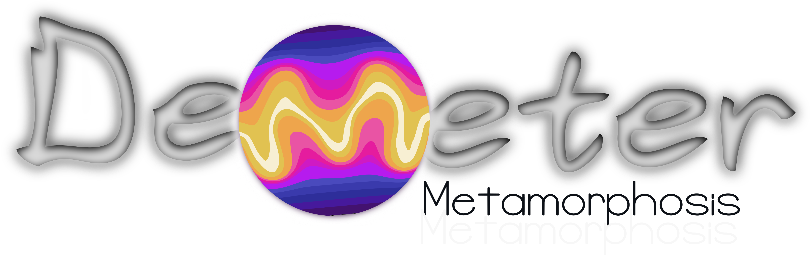

# Demeter 0.4

(DiffEoMorphic METamorphic Regristration)

**Warning** : This depot is still in progress. see [Documentation](https://antonfrancois.github.io/Demeter_metamorphosis/)

You are seeing the evolution of a new python librairy, intended to solve 
diffeomoprhic registration problems using metamorphosis, LDDMM and 
derived methods.
For more details on the methods please read the joined PDF :
`Metamorphic_image_registration_afrancois_pgori_jglaunes`.

Why Demeter ? Because in ancient Rome, Demeter was the goddess of agriculture.
Isn't it the perfect protection for or vectors fields ? 

## Requirement 

In this project depend on plural libraries, some quite basics like Numpy 


and some more complex. make sure that you have :
- [`torch 1.8`](https://pytorch.org/) or higher as we use the fft function 
- [`kornia`](https://pypi.org/project/kornia/).
- [`vedo 2021.0.5`](https://vedo.embl.es/) for 3D visualisation


Demeter plotting capabilities (i.e., functions start with plot_ and classes end with Display) require Matplotlib (>= 3.3.4). For running the examples Matplotlib >= 3.3.4 is required. A few examples require scikit-image >= 0.17.2, a few examples require pandas >= 1.2.0, some examples require seaborn >= 0.9.0 and plotly >= 5.14.0.

## Installation
At the moment, scikit-shapes is available on linux and macOS only

### From pip
The last stable version of demeter_metamorphosis can be installed directly from pip with
```bash
pip install demeter
```
### From source
If you want the development version or consider contributing to the codebase,
you can also install scikit-shapes locally from a clone of the repository. 
First clone the repository with one of the github provided methods. For
example, with ssh:
```bash
git clone git@github.com:antonfrancois/Demeter_metamorphosis.git
```
I advise you to create a fresh virtual environment with conda or venv. With venv [more...](https://packaging.python.org/en/latest/guides/installing-using-pip-and-virtual-environments/#create-and-use-virtual-environments):
conda
```bash
conda create -n demeter_env python=3.12
conda activate demeter_env
```
OR
```bash
python3.12 -m venv "demeter_env"
source "demeter_env"/bin/activate
```
Then activate it and navigate to the cloned repository. You can install the package with
```bash
cd Your/path/to/Demeter_metamorphosis
pip install -e .
```
It can take up to 10 minutes depending on your internet connection, mainly because of torch and nvidia driver installation. 


## Jupyter Notebooks and examples.

You can see results and usage exemples in the following jupyter notebooks located in the `examples` folder :
- **brain_weightedMetamorphosis.ipynb** : Examples and results of Weighted Metamorphosis method on real data (2D).

(to be updated soon)
- **figs_geodesic_stability_lddmm.ipynb** : Figure from the article aiming to show the stability 
  of semi-Lagrangian schemes over Eulerian ones for LDDMM.
- **fig_lddmm_vs_metamorphoses.ipynb** : Figure from the article aiming to 
compare our implementation of LDDMM and Metamorphosis.
- **toyExample_weightedMetamorphosis.ipynb** : Examples and results of Weighted Metamorphosis method on a synthetic toy example image.

__Note__ : vedo visualisation currently does not work in anaconda environment such as jupyter or ipython.
If you want to display a vedo visualisation that we implemented, run them in a python terminal. 
See :
- examples/metamorphosis_3D.py
- examples/visualizeMetamorphosis_3D.py

## File structure and containts
```
Demeter/
├── demeter/
│ ├── metamorphosis/
│ │ ├── abstract.py
│ │ ├── classic.py
│ │ ├── constrained.py
│ │ ├── data_cost.py 
│ │ ├── joined.py  (wainting for publication)
│ │ ├── wraps.py
│ ├── utils/
│ │ ├── bspline.py
│ │ ├── constants.py
| │ ├── cost_functions.py
│ │ ├── decorators.py
│ │ ├── fft_conv.py
│ │ ├── file_saves_overview.py
│ │ ├── optim.py
│ │ ├── reproducing_kernels.py
│ │ ├── toolbox.py
│ │ ├── torchbox.py
│ │ ├── vector_field_to_flow.py
├── doc/
├─ examples/
│ ├── gifs/
│ ├── im2Dbank/
│ ├── im3Dbank/
├── saved_optim/  # Folder to save the optimisation results
```
- **metamorphosis/** : the is containing the classes for LDDMM/metamorphic
regristration.
You  can import the whole module with 
`import demeter.metamorphosis as mt`
or import the classes individually:
  - In `abstract.py` you will find the abstract classes for the LDDMM/metamorphic registration that are at the basis of the other specific classes.
    - **class** `Geodesic_integrator` : (abstract) is the class 'tool kit' for integrating over a geodesic
    - **class** `Optimise_geodesicShooting` : (abstract) is the class 'tool kit' for optimizing using geodesic shooting methods. It works in combination with a child class of `Geodesic_integrator`.
  - In `classic.py` you will find the classes for the classic LDDMM and Metamorphosis registration as described by Trouvé et al. or Beg's 2005 paper. As LDDMM is a special case of Metamorphosis, the same classes are used for both methods. 
    - **class** `Metamorphosis_integrator`: (derived from `Geodesic_integrator`) is made for integration over LDDMM or Metamorphosis geodesics.
    - **class** `Metamorphosis_Shooting`: (derived from `Optimise_geodesicShooting`) Optimize a `Metamorphosis_path` object.
  - In `constrained.py` you will find the classes for the constrained LDDMM and Metamorphosis registration as described by me soon.
    - **class** `Residual_norm_function`: (abstract) Generic 'tool kit' class for defining a custom norm on $z_0$
    - **class** `Residual_norm_identity`: (derived from `Residual_norm_function`) definition of $\|\sqrt{M_t}z_t\|_{L_2}^2 = \lbrace z_t M_t ,z_t \rbrace$
    - **class** `Residual_norm_borderBoost`: (derived from `Residual_norm_function`) Experimental
    - **class** `ConstrainedMetamorphosis_integrator`: (derived from `Geodesic_integrator`) is made for integration with Weighted Metamorphosis method. It is defined with a function derived from an child object of `Residual_norm_function`.
    - **class** `ConstrainedMetamorphosis_Shooting`: (derived from `Optimise_geodesicShooting`) Optimize a `Weighted_meta_path` object.
    - **class** `Reduce_field_Optim` : (derived from `Optimise_geodesicShooting`) Optimize a `Weighted_meta_path` object. It was proposed as an example to show the metamorphosis framework flexibility. It is developed to register brains with the source having a glioblastoma and the target a healthy brain. It is well described in my thesis. 
  - In `data_cost.py` you will find the classes for the data cost functions. The default is the L2 norm data cost function but the library has been designed to allow one to define custom data cost functions.
    - **class** `Data_cost` : (abstract) is the class 'tool kit' for defining a data cost function.
    - ...
  - In `wraps.py` you will find wrapping functions to apply registrations. Unless you want to develop your own registration method, I strongly recommend to use only those wraps functions.
    - `lddmm`: To register two images with same topology using the classic LDDMM method.
    - `metamorphosis`: To register two images with different topologies using the classic Metamorphosis method.
    - `weighted_metamorphosis`: To register two images with different topologies using the Weighted Metamorphosis method. This method allow you to provide a temporal mask to add intensity additions only at the mask positive values.
    - `oriented_metamorphosis`: To register two images with different topologies using the Oriented Metamorphosis method. This method allow a pre-computed vector field to guide the registration.
    - `constrained_metamorphosis`: To register two images with different topologies using the Constrained Metamorphosis method. This is the combination of the Weighted and Oriented Metamorphosis methods.
    - .... (more to come)
- **utils/** This folder contains generic methods and classes necessary to do the registration computation (ex: Vector field integration,...) or visualization (ex: 3D visualization of images,...).

  - **toolbox.py** : is containing generic utilitary fonctions
  - **torchbox.py** : is containing utilitary function compatible with PyTorch 
  such as: 
    - wrapper for `kornia` and `PyTorch` utilitary functions.
    - function for plotting. 
  - **fft_conv.py** : functions from [Github : fkodom](https://github.com/fkodom/fft-conv-pytorch)

  - **reproducing_kernels.py** : Kornia inerited functions to use filter convolution
  with fft_conv. 

  - **constants.py** : Files with different constants reused at different locations
  - **decorators.py** : Files with different decorators reused at different locations
  - **image_3d_visualisation** : Visualisation function for 3D volumetric images using matplotlib or vedo.
  - **vector_field_to_flow.py** : Function to convert a temporal vector field to a single deformation.
  - **fill_saves_overview.py** : Gestion of saved geodesics_shooting in the csv file.

## Contact

You can email me at anton.francois [at] ens-paris-saclay.fr or check my website : [antonfrancois.github.io/](antonfrancois.github.io/)